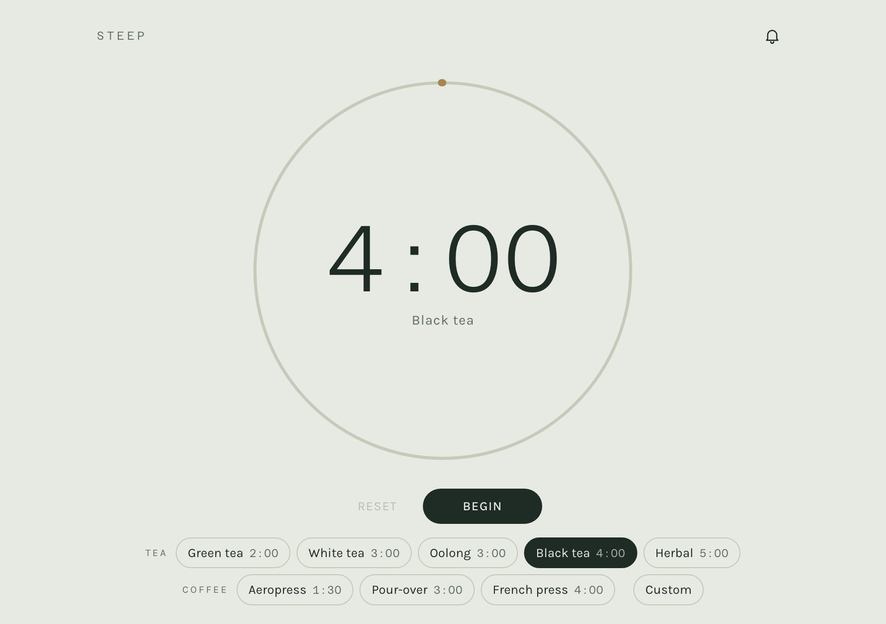
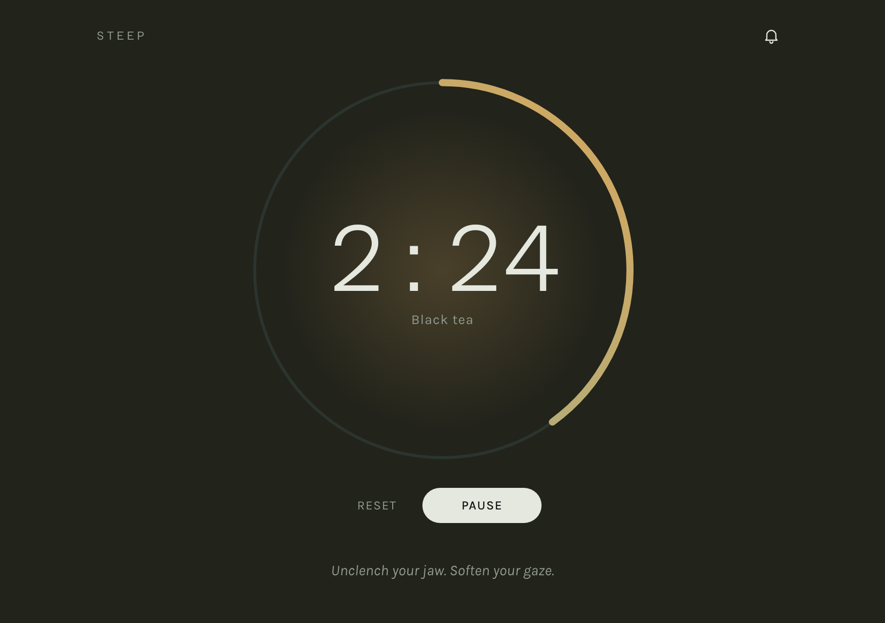
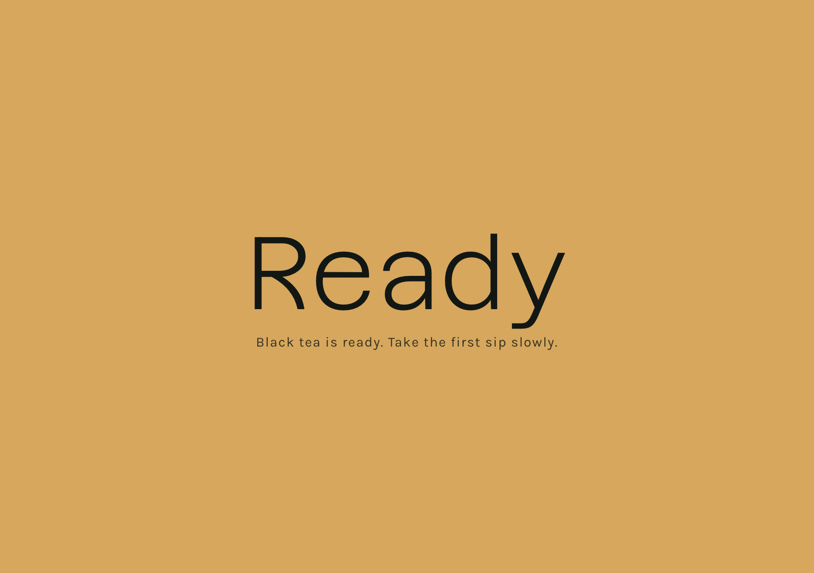
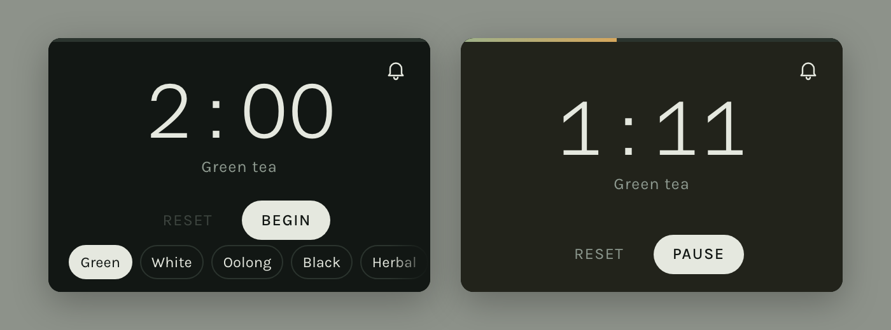

# Steep

A quiet tea and coffee timer that flashes when the brew is ready.

One HTML file, no dependencies, no build step. It is sized to stay legible when
shoved into the corner of a screen, which is the whole reason it exists:

> A very simple timer page that flashes when time is up, so I can place it on the
> edge/corner of screen and continue working.



## Use it

Open `index.html` in a browser. That's it — double-click the file, or serve the
folder if you prefer a URL:

```bash
python3 -m http.server 8000
```

Pick a brew, press Begin, and put the window wherever you can see it.

## What it does

- **Presets** for common teas and brew methods, plus a custom duration.
- **A steeping ring** that fills from moss to amber while the page background
  slowly warms, so progress reads from across the room without looking at digits.
- **Grounding prompts** that fade in and out during the brew — one line at a time,
  sixteen seconds apart.
- **A full-viewport flash** and a synthesised singing-bowl chime at zero. Click
  anywhere or press any key to dismiss.
- **Resume after reload.** The running timer, last preset, custom duration, and
  chime setting persist in `localStorage` under the key `steep.v1`. Because the end
  time is stored rather than the seconds remaining, a reload mid-brew picks up where
  the clock actually is, not where the page left off.

Mid-brew the presets step aside for the prompts, so the countdown never shifts:



At zero the whole window flashes:



### Presets

| Brew | Time |
|---|---|
| Green tea | 2:00 |
| White tea | 3:00 |
| Oolong | 3:00 |
| Black tea | 4:00 |
| Herbal | 5:00 |
| Aeropress | 1:30 |
| Pour-over | 3:00 |
| French press | 4:00 |
| Custom | whatever you set |

These are ordinary starting points, not gospel. To change them, edit the `PRESETS`
array near the top of the script in `index.html`. Times are in seconds.

### Keyboard

| Key | Action |
|---|---|
| `Space` | Begin, or pause a running timer |
| `R` | Reset |
| any key | Dismiss the ready flash |

### Corner mode

The layout sheds parts of itself as the window shrinks, so it survives being tucked
into a screen corner at roughly 300×200:



- Under 480px wide, preset labels shorten and durations drop away.
- Under 400px tall, the options and prompts collapse during a brew and the
  countdown takes the space back.
- Under 300px tall, the ring gives way to a hairline progress bar across the top
  edge and the presets become a horizontal scrolling strip.

The tab title also carries the countdown, so the timer is readable from the tab
strip when the window is behind something else.

## Notes

- **Sound** needs a user gesture before it can play, so the chime is armed when you
  press Begin. If the page reloads mid-brew and finishes without any click, the
  flash still fires but the chime may stay silent.
- **Browsers.** Modern evergreen only — it leans on `color-mix()` in OKLab and
  container queries, so roughly Safari 16.4+, Chrome 111+, Firefox 113+.
- **Themes.** Light and dark are both designed; the page follows your system
  setting.
- **Motion.** The breathing glow and the ready flash respect
  `prefers-reduced-motion`.

## Repo contents

| File | What it is |
|---|---|
| `index.html` | The whole application |
| `SESSION-TRAY-SPEC.md` | A spec describing one layout change, written to be handed to a sibling project |
| `screenshots/` | Images used by this README |
